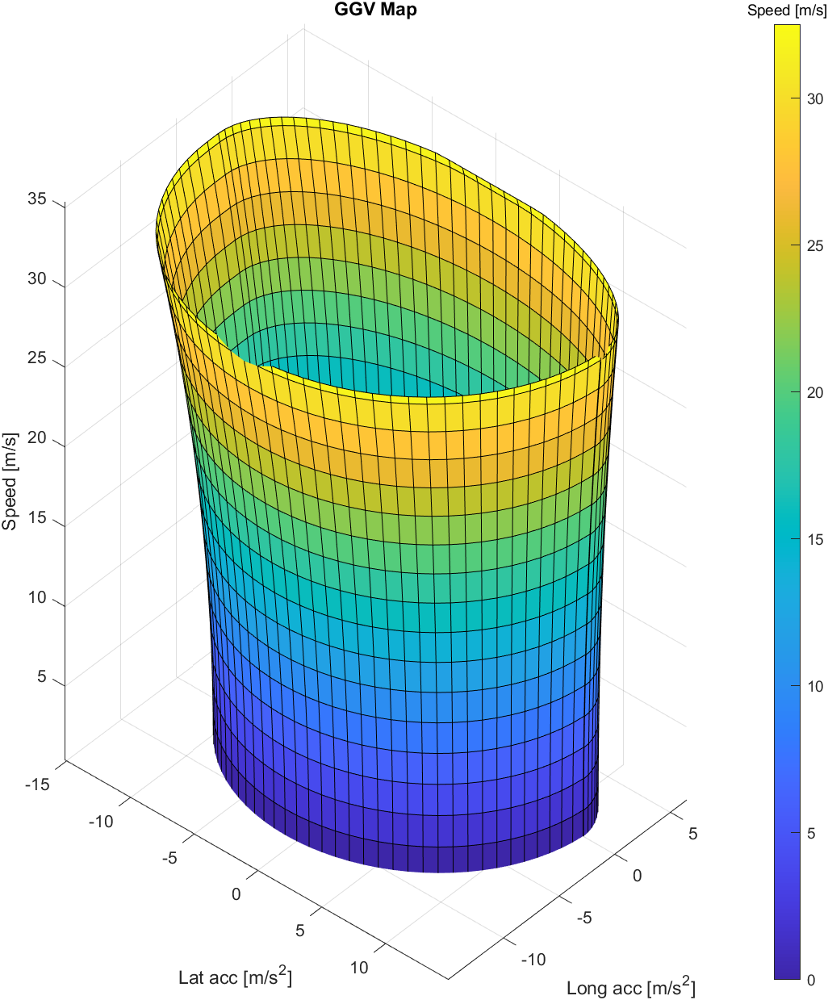
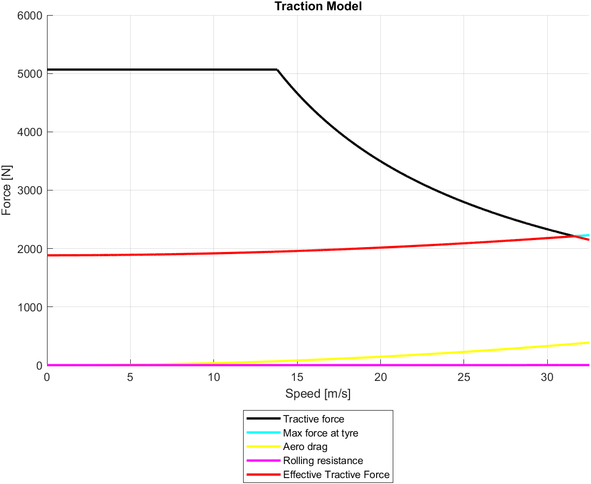
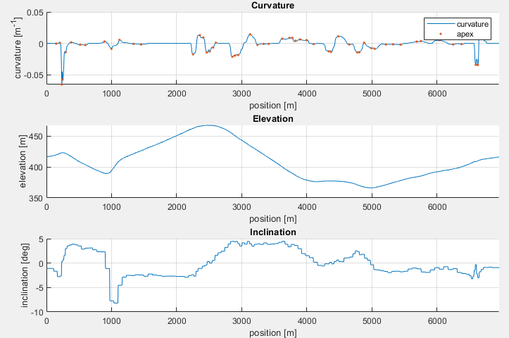
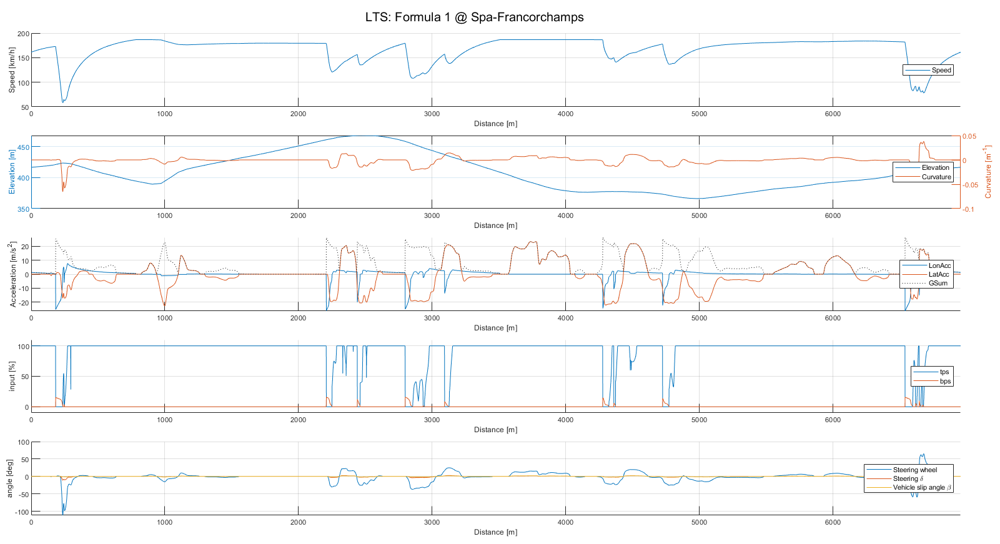
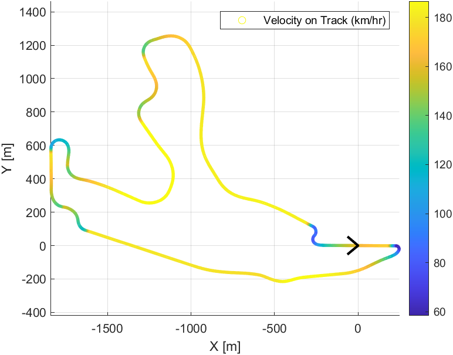

# Develop a Lap-Time Simulation and Energy Consumption Estimation Software for Electric Vehicles 

Bachelor of Engineering Capstone Project, completed by Abhishek Amit Kolekar, Soham Raju Khairnar, Parth Prasad Paranjpe, and Sarvesh Rajendra Pawar to model and simulate vehicle performance and energy consumption for Battery Electric Vehicles (BEVs).

## Abstract

 The mileage of a battery electric car is a significant difficulty in its design. Batteries can account for a substantial portion of the vehicle's weight, so they must be constructed for the least amount of storage space possible. This project implements a Lap Time Simulator 
(LTS) for Electric Vehicles (EV) with energy consumption estimation feature, and to analyze how the vehicle model's complexity influences simulation and estimation outcomes. A Formula Student prototype vehicle is parameterized in a Steady State LTS and a Quasi-Static LTS. The LTS designed by us is a Quasi-Static Bicycle Model. It is set to 
compete against and validated using a commercial Point Mass Model. The results show that the more complex and output rich Bicycle Model has the same approximate lap times with similar code runtime. It also provides energy consumption estimation that the commercial software does not. 
The goal of our project is to produce a lap time simulation tool that provides an adaptable, user-friendly, and virtual test environment for making better development decisions in an electric vehicle.

## Software(s)
- MATLAB 2021
- Excel

## Configuration
- `VehicleData.xlsx` contains all data relevant to the vehicle, which includes overall vehicle parameters, as well as parameters specific to aerodynamics, powertrain, and tires.
- The vehicle data is processed to find the vehicle's performance limits by the `VehicleModelv1.m` code, and stored in a `VEHICLE_<vehicle name>_<vehicle type>.mat` file in the `Vehicle Data` folder.
- Different tracks, namely Autodromo Nazionale Monza, Donington Park, FSAE Skidpad, Indianapolis Motor Speedway, and Spa-Francorchamps are taken due to the availability of data about the corner radii, straight-line lengths, and elevation.
- The track data is processed to find the limits and performance restraints set by the track layout by `TrackInput.m` code, and stored in the `Track data` folder as a `Track_<track name>.mat` file.
- The `LTS.m` code must import the processed vehicle and track data and the lap time simulation is carried out.

## Model Used
Quasi-Static 3DOF Model with pitch dynamics

## Outputs
 

## Most Relevant References
[1] Siegler, Blake, and David Crolla. “Lap Time Simulation for Racing Car Design.” SAE Transactions, vol. 111, 2002, pp. 306–14. JSTOR, http://www.jstor.org/stable/44699428.

[2] Milliken, William F., 1911-2012. Race Car Vehicle Dynamics. Warrendale, PA :Society of Automotive Engineers, 1995.

[3] Gillespie, Thomas D. Fundamentals of Vehicle Dynamics. SAE International, 1992.

[4] Siegler, Blake, et al. “Lap Time Simulation: Comparison of Steady State, Quasi- Static and Transient Racing Car Cornering Strategies.” SAE Transactions, vol. 109, 2000, pp. 2575–81. JSTOR, http://www.jstor.org/stable/44687095.

[5] Rill, G., & Arrieta Castro, A. (2020). Road Vehicle Dynamics: Fundamentals and Modeling with MATLAB® (2nd ed.). CRC Press. https://doi.org/10.1201/9780429244476

[6] Loureiro, José. [“Energy Consumption Estimation in Lap Time Simulation”](https://www.bing.com/ck/a?!&&p=244e43e80cace756JmltdHM9MTcyMjU1NjgwMCZpZ3VpZD0xZmNjNzhmZC1mYTE2LTY4ZjQtMjhlMy02YTliZmI3ZDY5ZTMmaW5zaWQ9NTIwNA&ptn=3&ver=2&hsh=3&fclid=1fcc78fd-fa16-68f4-28e3-6a9bfb7d69e3&psq=jose+loureiro+energy+consumption+estimation&u=a1aHR0cHM6Ly9mZW5peC50ZWNuaWNvLnVsaXNib2EucHQvZG93bmxvYWRGaWxlLzg0NDgyMDA2NzEyNTYyMy9yZXN1bW8ucGRm&ntb=1). Master’s Degree Thesis, University of Lisbon.

[7] Doyle, D., Cunningham, G., White, G., and Early, J., "Lap Time Simulation Tool for the Development of an Electric Formula Student Car," SAE Technical Paper 2019-01-0163, 2019, https://doi.org/10.4271/2019-01-0163.

[8] Toyoshima Takayuki, et al. “Lap Time Simulation Technology for Performance Design During Production Car Development.” Honda R&D Technical Review. 

[9] Chalkiopoulos, M., 2020, [OpenTRACK](https://github.com/mc12027/OpenLAP-Lap-Time-Simulator/blob/master/OpenTRACK.m). 
